```mermaid
flowchart TD
    A[🔧 make init] --> B1[🐳 start - Run Devpi with Docker Compose]
    B1 --> B2[🐍 venv - Create virtualenv]
    B2 --> B3[📦 install-deps - Install devpi-client & twine]
    B3 --> B4[🔐 login-root - Login as root]
    B4 --> B5[👤 create-user - Create LOCAL_PYPI_USER]
    B5 --> B6[📦 create-index - Create user index]
    B6 --> B7[📍 use-index - Use the target index]

    subgraph Daily Dev Flow
        D1[🔧 make build - Build Python package]
        D2[🚀 make upload - Upload to Devpi]
    end
    B7 --> Daily_Dev
    Daily_Dev --> D1
    D1 --> D2

    subgraph Restart Flow
        R1[make start - Restart Devpi]
        R2[make login - Login as user]
        R3[make use-index - Reuse the index]
    end
    R1 --> R2 --> R3

    subgraph Clean Up
        C1[🧹 make clean - Stop Docker and clean volume & venv]
    end

```

# Local PyPI Setup with `devpi`

 **Local PyPI server** using [Devpi](https://github.com/devpi/devpi), running in a Docker container. This server acts like a private PyPI repository for:

* **Hosting your own packages**
* **Proxying public PyPI for caching**
* **Isolated dev/test publishing workflows**

## ⚙️ Workflow Summary

1. **start Devpi Server**:

   ```bash
   make start
   ```

2. **Initialize Devpi (user, index)**:

   ```bash
   make init
   ```

3. **Login to Devpi**:

   ```bash
   make login
   ```


## 📦 Poetry Configuration to Use Devpi

Add the Devpi repository to your `pyproject.toml` like this:

```toml
[tool.poetry]
name = "your-package"
version = "0.1.0"
...

[[tool.poetry.source]]
name = "devpi"
url = "http://localhost:3141/myuser/dev"
default = false
```

Then install with:

```bash
poetry install --source devpi
```

To publish via **Poetry directly**, also add your credentials to Poetry config:

```bash
poetry config http-basic.devpi myuser secret
poetry publish --build -r devpi
```


